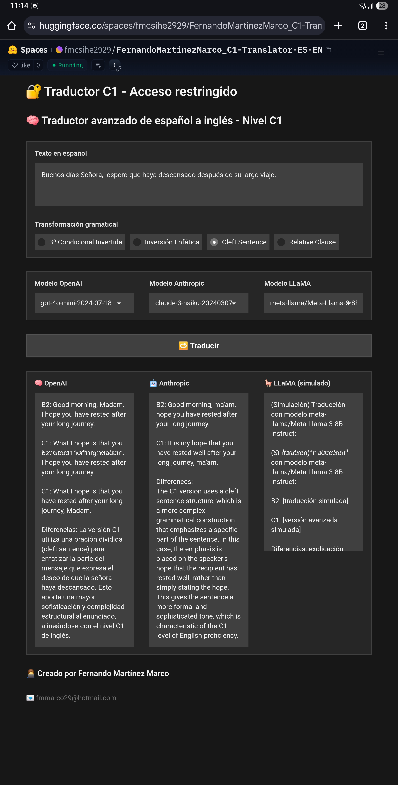

# 🧠 Traductor C1: Español → Inglés

Transformaciones gramaticales avanzadas con modelos de IA de última generación  
Traduce textos en español al nivel C1 del inglés aplicando estructuras como inversión enfática, cleft sentences y más.

---

## 🚀 Características destacadas

✅ Traducción desde el español con enfoque en gramática avanzada  
✅ Comparación clara entre niveles B2 y C1  
✅ Visualización horizontal de resultados por modelo  
✅ Compatible con los modelos más potentes y recientes de OpenAI, Anthropic y Meta

---

## 🧪 Transformaciones gramaticales soportadas

🔹 3ª Condicional Invertida  
🔹 Inversión Enfática  
🔹 Cleft Sentence  
🔹 Relative Clause

---

## 🤖 Modelos de IA disponibles

| Plataforma   | Modelos disponibles                                      |
|-------------|----------------------------------------------------------|
| 🧠 OpenAI    | gpt-4o, gpt-4, gpt-3.5-turbo                             |
| 🤖 Anthropic | claude-3-opus-20240229, claude-3-sonnet-20240229        |
| 🦙 LLaMA     | llama2-13b, llama3-8b (modelos gratuitos)                |

---

## 🔐 Acceso a la aplicación

La aplicación es pública, pero requiere una clave de acceso para evitar abusos de API.  
Se permite una prueba gratuita por IP antes de solicitar clave.

📩 **Solicita tu clave aquí:** fmmarco29@hotmail.com

---

## 🛠️ Cómo usar

1. Ingresa tu contraseña al iniciar.  
2. Introduce un texto en español.  
3. Selecciona una transformación gramatical.  
4. Elige los modelos deseados.  
5. Pulsa “🔁 Traducir” y compara resultados.

---

## 📸 Vista previa

---

## 👨‍💻 Autor

**Fernando Martínez Marco**  
📧 fmmarco29@hotmail.com

---

## 🏆 Reconocimiento

Este Space ha sido destacado por Hugging Face 🏆  
¡Gracias por tu apoyo 🙌!

⭐️ **Si te gusta este proyecto, dale un Like en la parte superior del Space.**